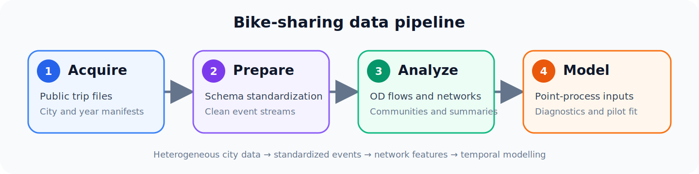
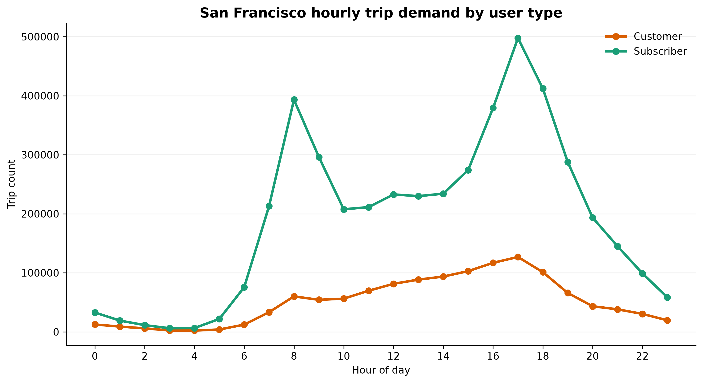
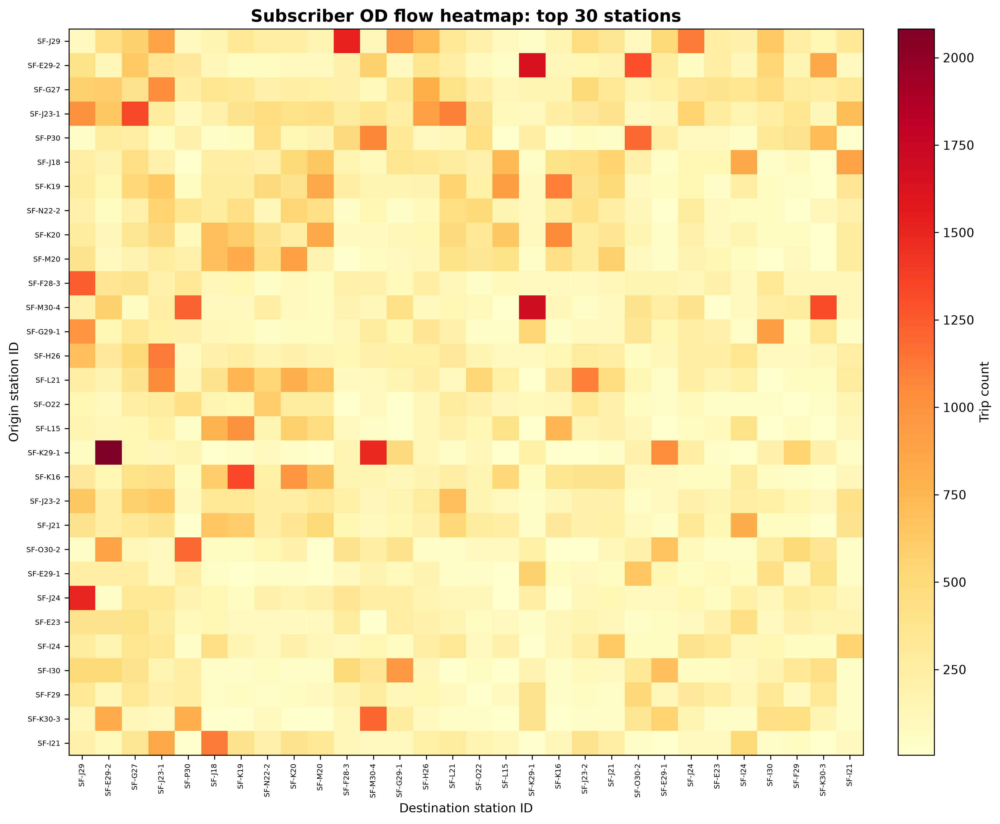
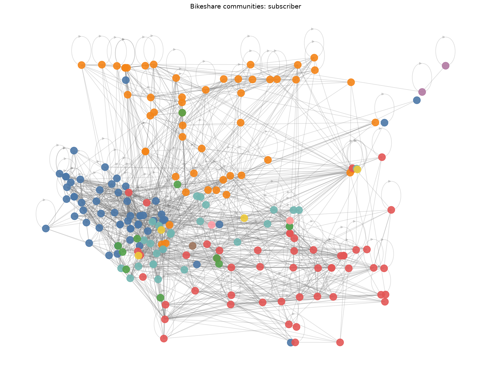

# Multi-city bike-sharing network analysis

An end-to-end Python workflow for turning heterogeneous bike-share trip files
into clean event data, origin-destination (OD) networks, and modelling-ready
features. The project covers data acquisition, chunked preprocessing,
descriptive analysis, graph construction, and point-process experiments across
San Francisco, Washington, DC, Portland, and Chicago.

## Project overview

- Standardises legacy and modern bike-share schemas into a common trip format.
- Processes large CSV collections in chunks and records data-quality summaries.
- Separates customer and subscriber demand for temporal and spatial analysis.
- Builds normalized directed OD networks and canonical station metadata.
- Produces reusable visualisations, graph exports, and point-process inputs.

**Stack:** Python 3.10+ · pandas · NumPy · SciPy · statsmodels · Matplotlib · NetworkX

## Processed data snapshot

| City | Raw rows processed | Cleaned trips retained |
| --- | ---: | ---: |
| San Francisco | 20,824,610 | 17,516,045 |
| Washington, DC | 49,350,687 | 43,775,863 |
| Portland | 1,226,107 | 670,026 |
| Chicago | 41,885,578 | 32,266,778 |
| **Total** | **113,286,982** | **94,228,712** |

## Pipeline

<p align="center">
  
</p>

## Results

### Analysis highlights

- User segmentation preserves distinct temporal demand profiles instead of
  blending customer and subscriber behaviour.
- Origin-normalized OD weights surface distinctive routes beyond the busiest
  stations.
- Station communities provide a practical structural summary for downstream
  network and event-process analysis.

### Demand by hour and user type

Subscriber demand has clear commuting peaks, while customer demand is lower
and more evenly distributed across the day.

<p align="center">
  
</p>

### Directed OD flows

The heatmap exposes recurring station pairs and the directional structure used
to construct weighted network edges.

<p align="center">
  
</p>

### Station communities

Community detection groups stations connected by recurring trips and provides
a compact view of a dense directed network.

<p align="center">
  
</p>

## Quick start

```bash
python3 -m venv .venv
.venv/bin/python -m pip install -r requirements.txt

# Download selected public files.
.venv/bin/python tools/download_bikeshare_data.py \
  --cities san_francisco \
  --years 2022 2023 \
  --output-root data

# Create cleaned trips and OD-network inputs.
.venv/bin/python tools/bikeshare_cleaning.py \
  "data/san_francisco/*.csv" "data/san_francisco/*.zip" \
  --city san_francisco \
  --output-dir outputs/san_francisco
```

## Main outputs

| Output | Purpose |
| --- | --- |
| `summary_overall.csv` | processing and data-quality summary |
| `summary_by_user_type.csv` | retained trips by customer/subscriber category |
| `station_pairs_normalized.csv` | directed OD counts and origin-normalized weights |
| `station_lookup_canonical.csv` | canonical station names and coordinates |
| `station_id_conflicts.csv` | station metadata inconsistencies for review |
| `cleaned_customer.csv`, `cleaned_subscriber.csv` | standardized row-level event streams |

## Repository structure

```text
.
├── data/                   # local data guide; downloaded files are ignored
├── docs/                   # workflow, methodology, scope, and README assets
├── tools/                  # download, cleaning, analysis, and graph scripts
├── modeling/
│   ├── pp_fitting/         # point-process diagnostics
│   └── fitting/            # univariate Hawkes pilot
└── requirements.txt
```

Raw and row-level processed datasets remain local and are excluded from Git.

## Documentation

- [End-to-end workflow](docs/workflow.md)
- [Methodology and reproducibility](docs/methodology.md)
- [Modelling scope](docs/modeling-scope.md)
- [Data pipeline commands](tools/README.md)
- [Modelling commands](modeling/README.md)
- [Data sources and local setup](data/README.md)

## License

Released under the [MIT License](LICENSE).
